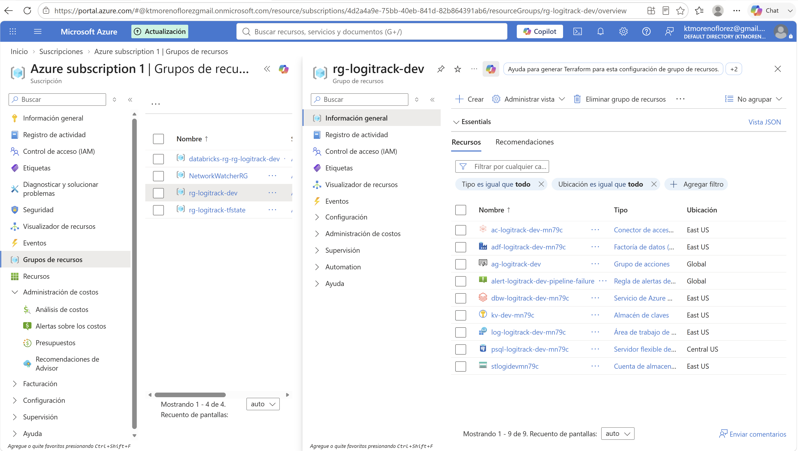
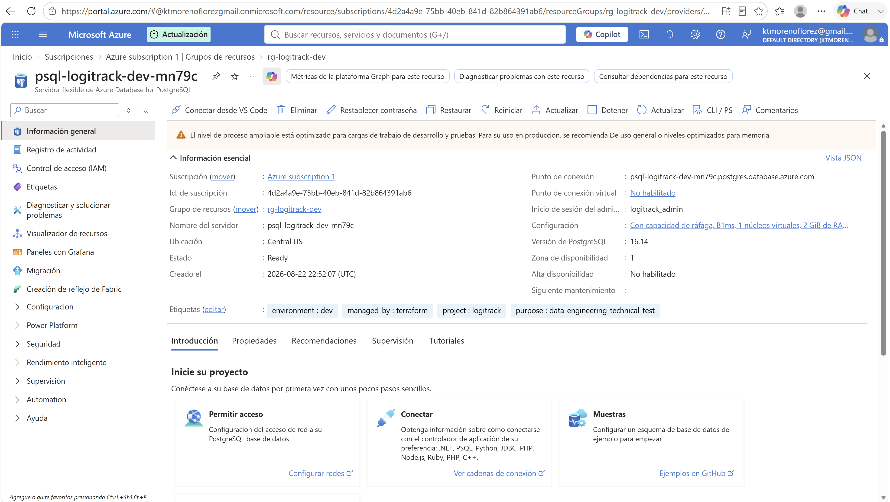
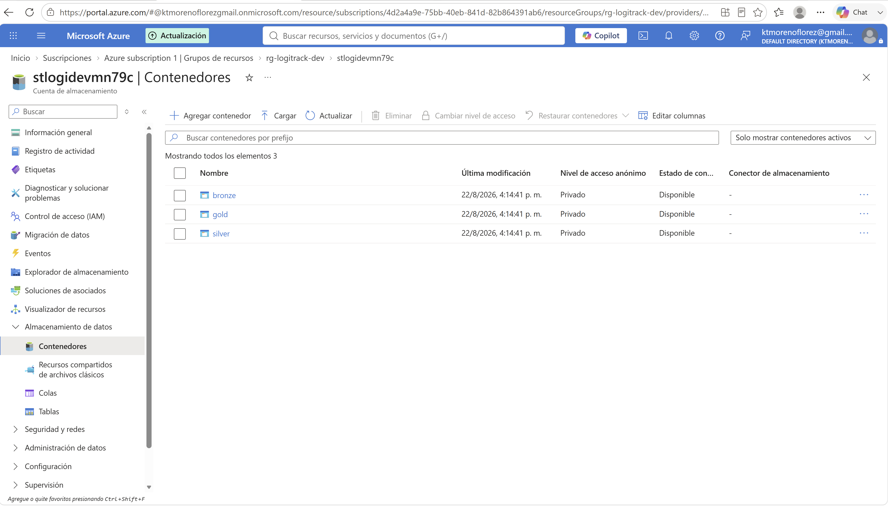
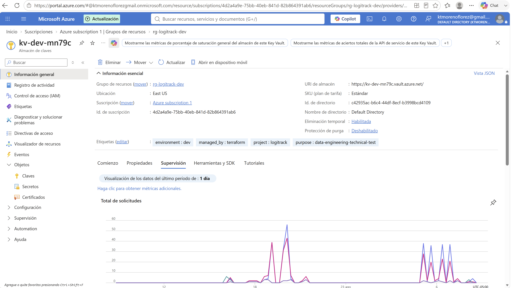
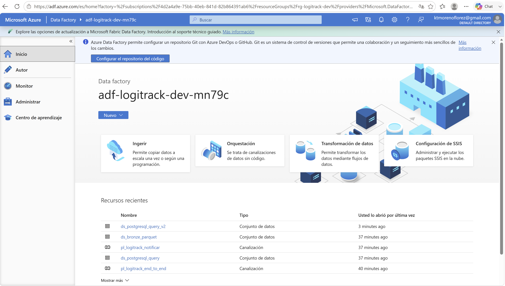
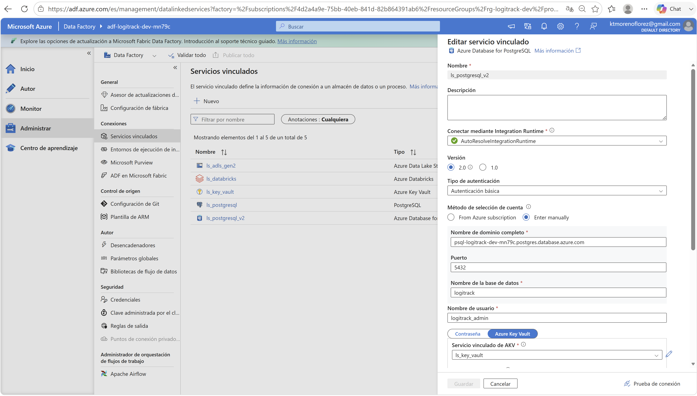
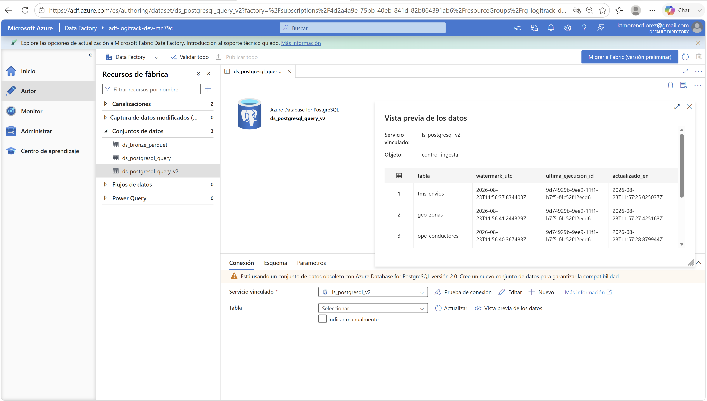
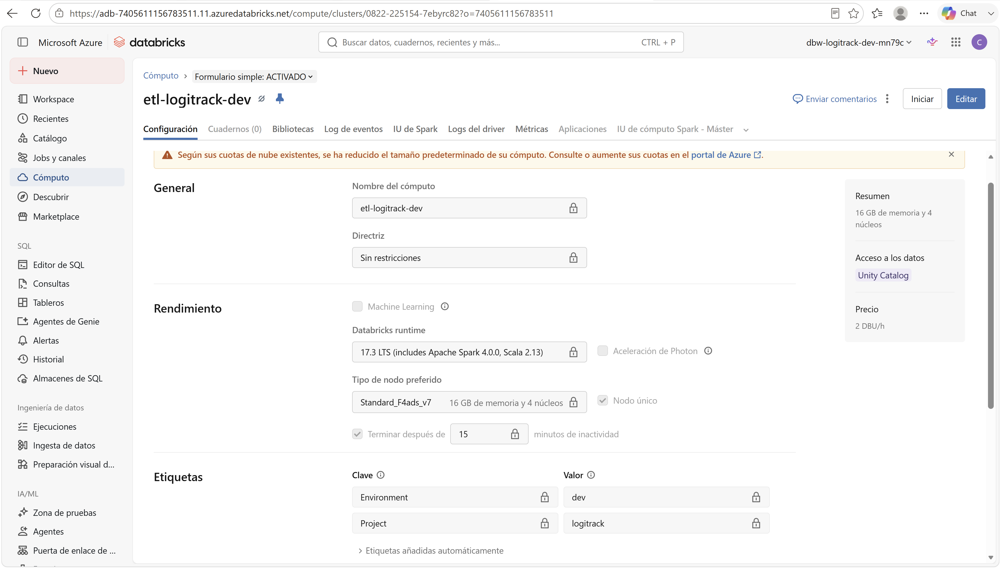
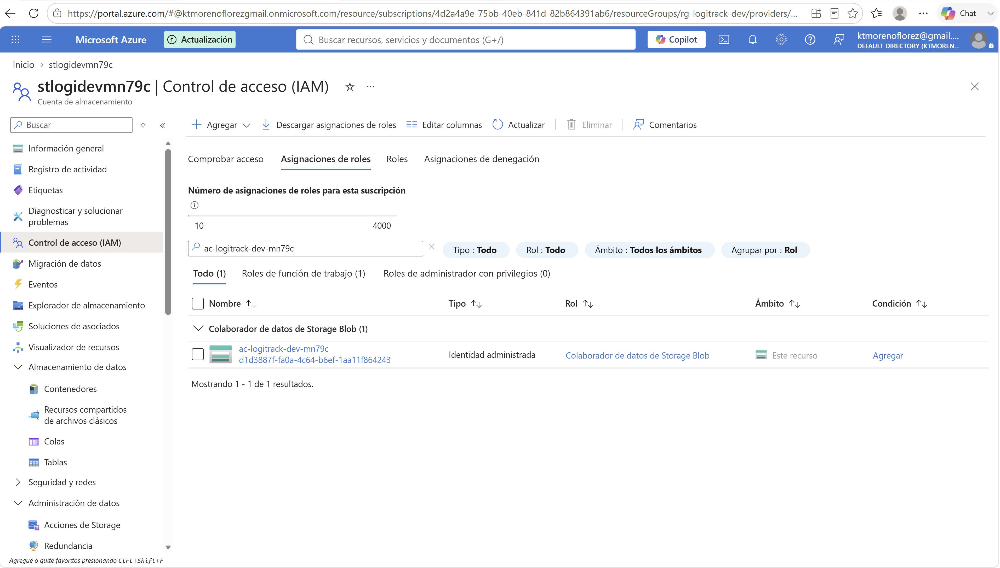
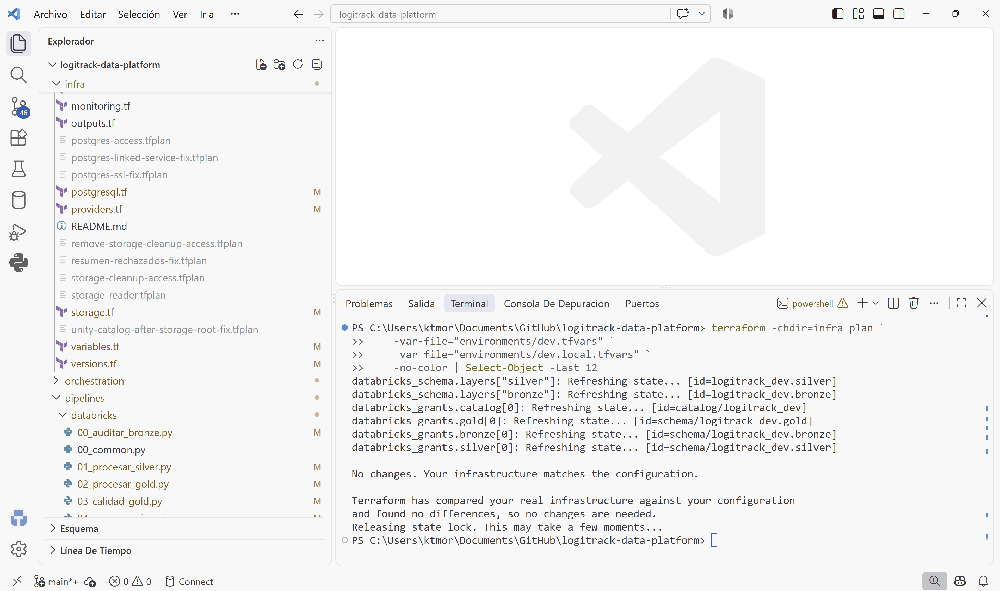

# Fase B - Despliegue de Azure DEV

## 1. Objetivo

Esta fase registra el despliegue y la validación de la infraestructura DEV de LogiTrack en Azure.

El objetivo fue disponer de una plataforma cloud reproducible mediante Terraform que permitiera posteriormente ejecutar la ingesta y el procesamiento end-to-end.

Las actividades descritas en este documento corresponden a acciones realmente ejecutadas durante el despliegue y la resolución de incidencias de infraestructura.

---

## 2. Recursos principales desplegados

La infraestructura DEV incluye:

- Azure Resource Group;
- Azure Database for PostgreSQL Flexible Server;
- Azure Storage Account con Data Lake Storage Gen2;
- contenedores/capas Bronze, Silver y Gold;
- Azure Key Vault;
- Azure Data Factory;
- Azure Databricks Workspace;
- cluster ETL de Databricks;
- Databricks Access Connector;
- Log Analytics Workspace;
- Azure Monitor;
- Action Group;
- linked services y datasets de ADF;
- permisos mediante Managed Identity;
- objetos base necesarios para Unity Catalog.

Los nombres observados durante las validaciones fueron:

```text
Resource Group:       rg-logitrack-dev
Data Factory:         adf-logitrack-dev-mn79c
PostgreSQL:           psql-logitrack-dev-mn79c
Storage Account:      stlogidevmn79c
Databricks Workspace: adb-7405611156783511.11.azuredatabricks.net
Log Analytics:        log-logitrack-dev-mn79c
Action Group:         ag-logitrack-dev
```

### Evidencia visual



*Figura B1. Recursos principales desplegados en el Resource Group `rg-logitrack-dev`.*

---

## 3. Terraform y reproducibilidad

La infraestructura se administra mediante Terraform.

Durante esta fase se fijaron, entre otros, los providers:

```text
azurerm    ~> 4.81.0
databricks ~> 1.124.0
azuread    ~> 3.9.0
random     ~> 3.9.0
azapi      ~> 2.12
```

Se incorporó `Azure/azapi` porque el linked service PostgreSQL V2 de Azure Data Factory requería propiedades que no estaban siendo materializadas correctamente mediante el recurso custom del provider AzureRM.

También quedaron versionados los archivos `.terraform.lock.hcl` para reducir variaciones de providers entre ejecuciones.

---

## 4. Estado remoto de Terraform

El bootstrap del backend fue endurecido para evitar exposición pública del Storage Account:

```hcl
allow_nested_items_to_be_public = false
```

El principal utilizado para ejecutar Terraform recibió:

```text
Storage Blob Data Contributor
```

sobre el Storage Account del estado remoto.

El contenedor del backend permanece privado.

---

## 5. Azure Database for PostgreSQL

Se desplegó Azure Database for PostgreSQL Flexible Server con:

```text
PostgreSQL: 16
Database:   logitrack
```

La versión se alineó con PostgreSQL 16 utilizado durante la validación local.

La ubicación puede configurarse mediante `postgres_location`, con fallback a la ubicación del Resource Group.

También se añadió:

```hcl
lifecycle {
  ignore_changes = [zone]
}
```

para evitar drift provocado por la zona asignada por Azure cuando esta no forma parte de la configuración que se desea controlar.

La contraseña administrativa no se incrusta en ADF. Se almacena como secreto en Azure Key Vault.

### Evidencia visual



*Figura B2. Azure Database for PostgreSQL Flexible Server desplegado para LogiTrack DEV.*

---

## 6. Azure Data Lake Storage Gen2

El Storage Account del lake utiliza:

```text
StorageV2
Hierarchical Namespace: habilitado
TLS mínimo: TLS 1.2
Replicación DEV: LRS
```

Se deshabilitó la posibilidad de hacer públicos elementos anidados:

```hcl
allow_nested_items_to_be_public = false
```

Se crearon las capas:

```text
bronze
silver
gold
```

La identidad del Databricks Access Connector tiene:

```text
Storage Blob Data Contributor
```

sobre el Storage Account.

Para las verificaciones manuales realizadas durante el desarrollo se añadió además:

```text
Storage Blob Data Reader
```

al principal del desarrollador únicamente en DEV.

Ese permiso no se crea en PROD.

### Evidencia visual



*Figura B3. Capas `bronze`, `silver` y `gold` creadas en ADLS Gen2.*

---

## 7. Azure Data Factory y PostgreSQL V2

Durante la integración de ADF con Azure PostgreSQL se identificó una incompatibilidad entre el dataset heredado y el conector PostgreSQL V2 requerido.

El recurso existente utilizaba:

```text
dataset: ds_postgresql_query
tipo: PostgreSqlV2Table
```

La solución final utiliza un linked service:

```text
ls_postgresql_v2
tipo: AzurePostgreSql
version: 2.0
authenticationType: Basic
```

La contraseña se obtiene mediante una referencia a Azure Key Vault.

### Evidencias visuales



*Figura B4. Secretos configurados en Azure Key Vault sin exposición de valores sensibles.*



*Figura B5. Azure Data Factory `adf-logitrack-dev-mn79c` desplegado en el ambiente DEV.*



*Figura B6. Linked Service `ls_postgresql_v2` configurado con el conector Azure PostgreSQL V2.*

El linked service se implementó con `azapi_resource` porque el recurso custom de AzureRM no materializaba correctamente `authenticationType` en ARM para este conector.

---

## 8. Migración no destructiva del dataset PostgreSQL

El primer intento de migración mostró que Azure Data Factory no permitía eliminar el dataset heredado mientras el pipeline todavía lo referenciaba.

El error observado correspondía a una dependencia activa de:

```text
pl_logitrack_end_to_end
```

sobre:

```text
ds_postgresql_query
```

Para evitar una migración destructiva se aplicó una estrategia en dos pasos.

Se conservó temporalmente:

```text
ds_postgresql_query
```

y se creó:

```text
ds_postgresql_query_v2
tipo: AzurePostgreSqlTable
```

El pipeline principal fue migrado para utilizar el nuevo dataset antes de intentar retirar los recursos heredados.

El plan utilizado para esta migración mostró:

```text
Plan: 1 to add, 2 to change, 0 to destroy.
```

La aplicación terminó correctamente.

Posteriormente se verificó que el pipeline contenía seis referencias al nuevo dataset y utilizaba `AzurePostgreSqlSource`.

### Evidencia visual



*Figura B7. Dataset `ds_postgresql_query_v2` utilizado por el pipeline después de la migración no destructiva.*

---

## 9. Incidencia de codificación JSON

Durante la modificación de:

```text
orchestration/adf/pipeline_principal.json
```

PowerShell introdujo inicialmente un BOM UTF-8.

Terraform detectó posteriormente:

```text
invalid character 'ï'
```

durante `jsondecode`.

El archivo se volvió a escribir explícitamente como UTF-8 sin BOM mediante `UTF8Encoding(false)`.

Después de la corrección:

```text
terraform validate
```

finalizó correctamente.

---

## 10. ADF hacia Databricks

Azure Data Factory utiliza su Managed Identity para conectarse al workspace Databricks.

La identidad se registra en Databricks como service principal y recibe:

```text
CAN_ATTACH_TO
```

sobre el cluster ETL.

No se introdujo un segundo mecanismo de autenticación con client secret para esta comunicación.

Durante el desarrollo se retiró la gestión explícita de `display_name` del service principal de Databricks porque el provider proponía un cambio de nombre no necesario sobre una identidad ya existente.

El principal real no fue sustituido.

---

## 11. Cluster ETL de Databricks

El cluster utilizado para las pruebas DEV quedó configurado con:

```text
Runtime:          Databricks Runtime 17.3 LTS
Node type:        Standard_F4ads_v7
Autotermination:  15 minutos
```

En DEV se utiliza modo single-node.

Terraform permite distinguir entre single-node y configuración con autoscaling.

Para el modo single-node se ignoran únicamente propiedades que Databricks introduce automáticamente, evitando drift continuo sobre:

```text
spark.databricks.cluster.profile
spark.master
ResourceClass
```

El cluster queda fijado mediante:

```hcl
is_pinned = true
```

### Evidencia visual



*Figura B8. Cluster `etl-logitrack-dev` utilizado por ADF para ejecutar los notebooks ETL.*

---

## 12. Preparación de acceso Databricks a ADLS

Durante las pruebas de integración Databricks inicialmente no pudo leer Bronze y produjo:

```text
Invalid configuration value detected for fs.azure.account.key
```

La arquitectura objetivo no utiliza una account key ni un client secret adicional para acceder al lake.

Se mantuvo la estrategia basada en:

```text
Databricks Access Connector
        +
Managed Identity
        +
Storage Credential
        +
External Locations
```

El Access Connector dispone de `Storage Blob Data Contributor` sobre el Storage Account.

No se implementó el fallback OAuth mediante Service Principal que se evaluó durante el diagnóstico.

---

## 13. Metastore y almacenamiento administrado

Se verificó que el workspace ya tenía un metastore de Unity Catalog asignado:

```text
workspace_id: 7405611156783511
metastore_id: e5942a45-f976-4073-84d3-b7c594c9016d
```

Al habilitar los objetos de Unity Catalog, la creación inicial del catálogo falló porque el metastore no tenía un storage root administrado.

El error indicó que era necesario proporcionar una ubicación para el catálogo.

Se añadió entonces un subpath dedicado:

```text
abfss://gold@stlogidevmn79c.dfs.core.windows.net/_unity_catalog/
```

separado del path administrado utilizado por los schemas.

Después de esa corrección, el plan pendiente fue:

```text
Plan: 8 to add, 0 to change, 0 to destroy.
```

y la aplicación finalizó correctamente.

El detalle de catálogo, schemas, grants y acceso por roles se documentará en la Fase D de gobierno.

---

## 14. Validación del acceso al almacenamiento

Se validó el Storage Credential de Unity Catalog contra las external locations Bronze, Silver y Gold.

Para las tres capas se obtuvo:

```text
READ                         PASS
LIST                         PASS
WRITE                        PASS
DELETE                       PASS
PATH_EXISTS                  PASS
HIERARCHICAL_NAMESPACE      PASS
```

La comprobación:

```text
READ_MESSAGE
```

asociada a file events devolvió `403`.

No se añadieron permisos de colas/eventos únicamente para hacer pasar esa comprobación, porque el pipeline actual utiliza procesamiento batch y no requiere file events.

Esta limitación se conserva como observación no bloqueante.

### Evidencia visual



*Figura B9. La identidad administrada del Databricks Access Connector dispone de `Storage Blob Data Contributor` sobre el Storage Account.*

---

## 15. Validación Terraform final

Después de los cambios de infraestructura y de los ajustes posteriores de notebooks se ejecutó nuevamente:

```powershell
terraform -chdir=infra plan `
    -var-file="environments/dev.tfvars" `
    -var-file="environments/dev.local.tfvars"
```

El resultado final observado fue:

```text
No changes. Your infrastructure matches the configuration.
```

Por tanto, al cierre de esta fase, la infraestructura desplegada coincide con la configuración Terraform local.

### Evidencia visual



*Figura B10. `terraform plan` final sin diferencias entre la configuración declarada y la infraestructura desplegada.*

---

## 16. Resultado de la fase

La infraestructura DEV necesaria para ejecutar el pipeline quedó disponible y sincronizada con Terraform.

Se validaron específicamente:

- PostgreSQL 16 desplegado en Azure;
- Key Vault para secretos;
- ADLS Gen2 con Bronze, Silver y Gold;
- Managed Identity de ADF;
- linked service PostgreSQL V2;
- migración no destructiva del dataset PostgreSQL de ADF;
- conexión ADF hacia Databricks mediante Managed Identity;
- cluster ETL disponible;
- Access Connector de Databricks;
- acceso de Databricks al lake sin account keys;
- preparación de Unity Catalog;
- Terraform sin drift al finalizar.

La validación funcional completa Bronze -> Silver -> Gold se documenta separadamente en la Fase C.

---

## 17. Índice de evidencias visuales

Las capturas de esta fase se almacenan en:

```text
docs/evidencias/fase_b/
```

| Figura | Archivo | Evidencia |
|---|---|---|
| B1 | `01_resource_group.png` | Recursos principales del ambiente DEV |
| B2 | `02_postgresql_overview.png` | Azure PostgreSQL Flexible Server |
| B3 | `03_adls_capas.png` | Capas Bronze, Silver y Gold en ADLS Gen2 |
| B4 | `04_key_vault_secrets.png` | Secretos de Key Vault sin exponer valores |
| B5 | `05_adf_overview.png` | Azure Data Factory DEV |
| B6 | `06_adf_linked_service_postgresql_v2.png` | Linked Service PostgreSQL V2 |
| B7 | `07_adf_dataset_postgresql_v2.png` | Dataset PostgreSQL V2 |
| B8 | `08_databricks_cluster.png` | Cluster ETL de Databricks |
| B9 | `09_access_connector_iam.png` | IAM del Access Connector sobre ADLS |
| B10 | `10_terraform_no_changes.png` | Terraform final sin drift |

---

## 18. Pendientes después de la Fase B


Al cierre de esta fase permanecen intencionalmente pendientes:

1. retirar `ds_postgresql_query` heredado únicamente después de comprobar que no existen referencias activas en ADF;
2. retirar `ls_postgresql` heredado únicamente después de la misma comprobación;
3. completar y documentar el gobierno mediante Unity Catalog;
4. habilitar y validar SQL Warehouse;
5. configurar y demostrar los permisos de Analyst y Admin;
6. recopilar las evidencias finales requeridas para la entrega.

No se consideran completados en esta fase los puntos anteriores.
