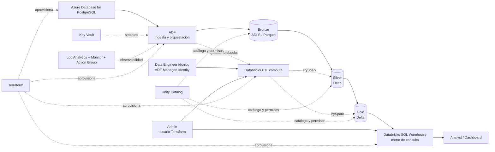

# LogiTrack Data Platform — Azure End-to-End

## 1. Sector y plataforma seleccionados

- **Sector:** Logística y cadena de suministro — LogiTrack.
- **Cloud:** Microsoft Azure.
- **IaC:** Terraform.
- **Patrón de datos:** Medallion (`Bronze → Silver → Gold`).
**Flujo funcional:** `Ingesta → Bronze → Silver → Gold → Consumo analítico`.

La solución separa responsabilidades: Azure Data Factory realiza la ingesta incremental desde PostgreSQL y orquesta el flujo; Azure Databricks ejecuta las transformaciones de Silver y Gold; ADLS Gen2 almacena las tres capas Medallion; Azure Key Vault centraliza secretos; Log Analytics/Azure Monitor cubren observabilidad; Unity Catalog gobierna los objetos y permisos.

`Consumo analítico` no es una cuarta capa física ni un esquema adicional. Los usuarios autorizados consultan directamente Gold a través de Databricks SQL Warehouse. Un dashboard, incluido Power BI si se quisiera usar, puede conectarse al Warehouse sin copiar nuevamente los datos. Power BI no es un entregable obligatorio de esta solución.

## Documentación técnica

La documentación compartible de la solución se encuentra en:

- `VALIDACION_LOCAL.md`: evidencia de la fase local realmente ejecutada.
- `docs/arquitectura.md`: decisiones y componentes de arquitectura.
- `docs/modelo_er.md`: modelo relacional de la fuente.
- `docs/catalogo_datos.md`: catálogo de objetos y campos.
- `docs/linaje.md`: linaje de campos Gold relevantes.
- `docs/calidad.md`: controles de calidad.
- `docs/anomalias.md`: anomalías sintéticas controladas.
- `docs/evidencias/README.md`: evidencias requeridas para las fases cloud.
- `docs/diagramas/`: diagramas Mermaid de arquitectura, ambientes, modelo fuente, ingesta incremental, Medallion, orquestación, Gold y gobierno.

El desarrollo sigue un enfoque **local-first**: primero se validan generación, formatos, anomalías, esquema y PostgreSQL en Docker; después se despliegan y validan los componentes cloud.

## 2. Arquitectura



El mismo diagrama se incluye como archivo Mermaid independiente en `docs/arquitectura.mmd`.

### 2.1 Capas de datos vs. consumo

Solo existen tres capas de datos: `bronze`, `silver` y `gold`. `Consumo analítico` no es una cuarta capa ni un esquema adicional: Databricks SQL Warehouse consulta directamente los objetos Gold autorizados por Unity Catalog.

```text
bronze  -> dato crudo
silver  -> dato limpio y confiable
gold    -> modelo analítico y KPIs
             |
             +-> Unity Catalog controla acceso
             +-> SQL Warehouse ejecuta consultas
             +-> Analyst / dashboard consume Gold
```

### 2.2 Segmentación de personas y compute

La separación se mantiene deliberadamente simple: no se crea un cluster por persona.

| Rol | Compute | Acceso a datos |
|---|---|---|
| Data Engineer técnico | Cluster ETL de Databricks | lectura/escritura Bronze, Silver y Gold |
| Analyst | Databricks SQL Warehouse | solo `SELECT` en Gold |
| Admin | Cluster ETL + SQL Warehouse | control total |

El principal técnico de Data Engineer es la Managed Identity de ADF registrada en Databricks. Analyst no recibe permisos sobre el cluster ETL ni sobre Bronze/Silver. Admin conserva control administrativo del workspace. Esta separación aplica mínimo privilegio sin introducir clusters innecesarios ni costo adicional.

## 3. Ambientes

El mismo código soporta `dev` y `prod`.

- `infra/environments/dev.tfvars`: recursos pequeños y volúmenes reducidos para iterar.
- `infra/environments/prod.tfvars`: configuración final y volúmenes mínimos completos.
- Cada ambiente usa un state remoto diferente.

## 4. Estructura

```text
pyproject.toml        dependencias Python y configuración de pytest
poetry.toml           entorno local del proyecto en .venv/
compose.yaml          PostgreSQL 16 local para desarrollo
.env.local.example    plantilla de variables locales; .env.local no se versiona
infra/                Terraform, backend y configuración dev/prod
data-generation/      generación, esquema SQL y carga a PostgreSQL
pipelines/             notebooks PySpark de auditoría/Silver/Gold/calidad
orchestration/         pipeline principal y notificador ADF como código
governance/            verificación de permisos de Unity Catalog
docs/                  arquitectura, ER, catálogo, linaje y evidencias
tests/                 pruebas locales del generador/configuración
scripts/               validaciones del repositorio
```

## 5. Prerrequisitos

Instalar en el equipo:

- Git
- Python 3.11, 3.12 o 3.13
- Poetry 2.x
- Azure CLI
- Terraform 1.8+
- Docker Desktop con Docker Compose

Autenticarse antes de usar Terraform:

```powershell
az login
az account show
```

Crear el entorno Python del proyecto con Poetry:

```powershell
poetry install
poetry env info --path
poetry run pytest
poetry run python scripts/validar_repo.py
```

`poetry.toml` fuerza un entorno virtual local en `.venv/`, exclusivo de este repositorio. No es necesario activarlo manualmente: `poetry run` ejecuta siempre dentro del entorno correcto. El archivo `.venv/` está ignorado por Git.

La primera vez que se resuelvan las dependencias, Poetry generará `poetry.lock`. Antes de compartir el repositorio, ese archivo debe quedar versionado para que el evaluador instale exactamente la misma resolución de dependencias.

Poetry administra las dependencias de **Python local** (generación, carga a PostgreSQL, scripts auxiliares y pruebas). PySpark no se instala localmente porque los notebooks se ejecutan en el runtime administrado de Azure Databricks.

## 6. Desarrollo local antes de Azure

PostgreSQL local **no reemplaza** la fuente cloud final. Se usa para validar rápido y sin costo el generador, el esquema, la carga y `ts_actualizacion`. ADF no se conecta a `localhost`.

### 6.1 Preparar PostgreSQL local

Copia la plantilla local y cambia únicamente la contraseña local:

```powershell
Copy-Item .env.local.example .env.local
```

Levanta PostgreSQL 16:

```powershell
docker compose --env-file .env.local up -d
docker compose ps
```

Genera un conjunto pequeño:

```powershell
poetry run python data-generation/generar_datos.py --profile dev
```

Cárgalo al PostgreSQL local:

```powershell
poetry run python data-generation/cargar_postgresql.py --profile dev --truncate --env-file .env.local
```

La carga crea el esquema, inserta las siete tablas y muestra sus conteos. `--truncate` se usa durante desarrollo reproducible; no representa el comportamiento incremental de ADF.

Para detener PostgreSQL conservando sus datos:

```powershell
docker compose --env-file .env.local stop
```

Para eliminar contenedor **y volumen local** y comenzar desde cero:

```powershell
docker compose --env-file .env.local down -v
```

### 6.2 Validar la fuente local

Entra a `psql` dentro del contenedor:

```powershell
docker compose --env-file .env.local exec postgres psql -U logitrack_admin -d logitrack
```

Comprueba, por ejemplo:

```sql
SELECT COUNT(*) FROM tms_envios;
SELECT MIN(fec_recepcion), MAX(fec_recepcion) FROM tms_envios;
SELECT tabla, watermark_utc FROM control_ingesta ORDER BY tabla;
```

Prueba el campo técnico incremental sin cambiar lógica de negocio:

```sql
UPDATE ope_conductores
SET activo = activo
WHERE cond_id = (SELECT cond_id FROM ope_conductores ORDER BY cond_id LIMIT 1)
RETURNING cond_id, ts_actualizacion;
```

La columna `ts_actualizacion` debe actualizarse mediante el trigger. Esto valida la base que ADF utilizará después para detectar altas/cambios.

### 6.3 Paso a Azure

Solo cuando generación + esquema + carga local funcionen, pasa a Azure. El **mismo** `generar_datos.py`, `00_schema.sql` y `cargar_postgresql.py` se reutilizan; solo cambia la conexión.

## 7. Despliegue Azure DEV

### 7.1 Crear y migrar el backend de Terraform


```powershell
terraform -chdir=infra/bootstrap init -backend=false
terraform -chdir=infra/bootstrap apply
```

Copia el output `storage_account_name` en `infra/bootstrap/backend.hcl` usando `backend.hcl.example` como plantilla. Después migra el state local del bootstrap:

```powershell
terraform -chdir=infra/bootstrap init -migrate-state -backend-config=backend.hcl
```

Crea también `infra/backend/backend-dev.hcl` a partir de `backend-dev.hcl.example`.

### 7.2 Personalizar DEV

Edita `infra/environments/dev.tfvars` antes del primer apply:

- `alert_email`: correo real para Action Group.
- `developer_public_ip`: IP pública del equipo si cargarás PostgreSQL desde tu computador.
- El rol Analyst se representa mediante un service principal técnico de Databricks, creado por Terraform cuando se habilita el SQL Warehouse.
- `enable_sql_warehouse`: en `dev` queda `false` por defecto; actívalo solo para la evidencia de consumo.
- `enable_daily_trigger`: en `dev` queda `false` para evitar ejecuciones automáticas mientras desarrollas; actívalo para demostrar la programación diaria.
- Para evidenciar el resumen diario y la alerta diferenciada de volumen en un canal, guarda primero el webhook en Key Vault con `poetry run python scripts/configurar_webhook.py --vault-url <key_vault_uri>` y después cambia `enable_notifications=true`.

### 7.3 Crear infraestructura DEV

```powershell
terraform -chdir=infra init -backend-config=backend/backend-dev.hcl
terraform -chdir=infra fmt -check
terraform -chdir=infra validate
terraform -chdir=infra plan -var-file=environments/dev.tfvars
terraform -chdir=infra apply -var-file=environments/dev.tfvars
```

Guarda evidencia del `apply` y de los outputs.

### 7.4 Reutilizar los mismos datos DEV

Si `data-generation/output/dev/` sigue disponible desde la prueba local, **no necesitas volver a generar nada**: usa exactamente esos archivos al cargar Azure PostgreSQL. Si limpiaste la carpeta, vuelve a generarlos con:

```powershell
poetry run python data-generation/generar_datos.py --profile dev
```

Esto permite comparar local y cloud con el mismo dataset reproducible.

### 7.5 Cargar Azure Database for PostgreSQL

Obtén del `terraform output` el FQDN, base de datos y Key Vault. Configura las variables de sesión:

```powershell
$env:PGHOST="<postgresql_fqdn>"
$env:PGDATABASE="logitrack"
$env:PGUSER="logitrack_admin"
$env:AZURE_KEY_VAULT_URL="<key_vault_uri>"
```

Carga el origen de forma reproducible. No uses `--env-file .env.local` aquí: las variables de sesión apuntan a Azure y la contraseña se recupera de Key Vault o se solicita de forma oculta.

```powershell
poetry run python data-generation/cargar_postgresql.py --profile dev --truncate
```

El script imprime `SELECT COUNT(*)` para las siete tablas.

### 7.6 Configurar notificaciones del canal (para la evidencia)

Después del primer `apply`, toma `key_vault_uri` de los outputs y ejecuta:

```powershell
poetry run python scripts/configurar_webhook.py --vault-url "<key_vault_uri>"
```

El script solicita la URL de forma oculta y la guarda como `notification-webhook-url` en Key Vault. Luego cambia `enable_notifications = true` en el archivo del ambiente y vuelve a ejecutar `terraform apply`.

### 7.7 Ejecutar ADF

Terraform crea `pl_logitrack_end_to_end`. La primera ejecución normal ya procesa todos los registros porque el watermark inicia en 1900. También puede ejecutarse manualmente con `carga_completa=true` para una prueba controlada.

El DAG ejecuta:

```text
7 fuentes PostgreSQL
      ↓
Bronze Parquet
      ↓
Auditoría Bronze
      ↓
Silver Delta
      ↓
Gold Delta
      ↓
5 controles de calidad
      ↓
Resumen de ejecución
```

La programación automática es diaria a las **02:00 de Bogotá**, configurada como **07:00 UTC**.

## 8. Ingesta Bronze

ADF trabaja con un `ForEach` parametrizado para las siete tablas. Para cada tabla:

1. consulta `control_ingesta.watermark_utc`;
2. toma un watermark final;
3. copia únicamente `ts_actualizacion > inicio AND <= fin`;
4. si la copia falla, reintenta hasta tres intentos con esperas de 30 y 60 segundos;
5. agrega `_ingesta_ts`, `_sistema_fuente` y `_batch_id`;
6. escribe Parquet particionado `anio/mes/dia`;
7. registra filas, bytes y duración en `log_ingesta_adf`;
8. actualiza el watermark únicamente después del éxito.

## 9. Silver

`01_procesar_silver.py`:

- estandariza tipos;
- rechaza campos obligatorios nulos;
- deduplica por clave de negocio;
- valida integridad referencial;
- rechaza peso no positivo y fecha imposible;
- aplica estrategia explícita de nulos;
- elimina texto/nombres sensibles en claro y conserva hashes;
- escribe `silver.errores_pipeline` y `silver.reporte_calidad`.

Las tablas de negocio Silver se sobrescriben desde el conjunto acumulado de Bronze. Esta decisión simplifica la prueba y mantiene idempotencia: el mismo Bronze produce el mismo Silver.

## 10. Gold

`02_procesar_gold.py` construye:

**Dimensiones**

- `dim_conductores`
- `dim_remitentes`
- `dim_zonas`

**Hechos**

- `fact_envios`
- `fact_rutas`
- `fact_desempeno_conductor`
- `fact_trazabilidad_envio`
- `fact_alertas_zona`

**Agregaciones/KPI**

- `agg_desempeno_zona`
- `agg_sla_remitente`
- `agg_tipo_paquete`
- `kpi_logistica_diaria`

La fórmula de desempeño usa los pesos definidos por el caso: éxito 35%, adherencia 20%, velocidad 20%, inversa de intentos 15% y calificación 10%.

## 11. Calidad e idempotencia

Gold ejecuta exactamente cinco controles automáticos:

1. `id_envio` no nulo;
2. `id_envio` único;
3. conductor existente;
4. peso positivo;
5. fecha de entrega coherente.

Los resultados se guardan en `gold.resultados_calidad`.

La idempotencia se obtiene combinando watermark en Bronze, deduplicación en Silver y sobrescritura determinística de Silver/Gold. Los historiales de auditoría y calidad se anexan por `batch_id`.

## 12. Seguridad y gobierno

- PostgreSQL genera la contraseña en Terraform y la almacena en Key Vault.
- ADF usa Managed Identity para ADLS y Azure Databricks.
- No hay tokens o contraseñas estáticas en Git.
- Los datos potencialmente sensibles se protegen desde Silver.
- Unity Catalog aplica los grants de Data Engineer, Analyst y Admin.
- Analyst no recibe grants sobre Bronze/Silver y recibe `SELECT` sobre Gold.
- La evidencia final de permisos usa el service principal técnico de Analyst para demostrar acceso a Gold y ausencia de permisos sobre Bronze y Silver.

Ver `governance/README.md` y `governance/permisos.sql`.

## 13. Monitoreo y alertas

- ADF envía diagnósticos a Log Analytics.
- Azure Monitor + Action Group funcionan como alerta secundaria de fallo del pipeline.
- `pl_logitrack_notificar` centraliza los mensajes por webhook para evitar repetir lógica: fallos de tarea, anomalía de volumen y resumen diario.
- `00_auditar_bronze.py` compara volumen contra hasta siete ejecuciones previas. Si la desviación supera 30%, persiste `silver.alertas_volumen`, devuelve `VOLUME_ALERT`, ADF envía una notificación diferenciada al webhook configurado y detiene el flujo antes de Silver.
- `04_resumen_ejecucion.py` guarda conteos por capa y por tabla, rechazados, alertas de calidad y duración total en `gold.resumen_ejecuciones`. Al finalizar con éxito, ADF envía ese resumen al webhook configurado.
- El webhook es opcional durante desarrollo y necesario para obtener la evidencia de las notificaciones de resumen y anomalía de volumen. La URL se captura de forma oculta con `scripts/configurar_webhook.py` y queda almacenada directamente en Key Vault; no pasa por Git, `.tfvars`, variables de entorno ni Terraform state.

## 14. Reintentos y manejo de errores

La copia crítica PostgreSQL → Bronze tiene tres intentos explícitos en ADF con backoff exponencial de 30 y 60 segundos. Las operaciones de lectura/escritura Spark reintentan únicamente fallos transitorios con esperas de 5, 10 y 20 segundos; errores de lógica o esquema se relanzan inmediatamente.

Los notebooks se ejecutan mediante `run_notebook`, que registra las excepciones operacionales en `silver.errores_pipeline` antes de propagarlas a ADF. ADF envía además un mensaje de fallo con pipeline, tarea, fecha y error mediante el pipeline reutilizable de notificaciones. Si el propio almacenamiento no está disponible, el intento de registrar el error no oculta la excepción original.

## 15. PROD

Cuando DEV esté validado:

```powershell
terraform -chdir=infra init -reconfigure -backend-config=backend/backend-prod.hcl
terraform -chdir=infra plan -var-file=environments/prod.tfvars
terraform -chdir=infra apply -var-file=environments/prod.tfvars
poetry run python data-generation/generar_datos.py --profile prod
```

Carga el volumen `prod` al PostgreSQL de producción usando el mismo script y variables del entorno correspondiente.

No es necesario mantener DEV y PROD encendidos simultáneamente durante el desarrollo.

## 16. Evidencias

Ver `docs/evidencias/README.md`. Las capturas deben provenir de la ejecución real en la suscripción usada para la prueba.

## 17. Decisiones deliberadas de alcance

No se añadieron dbt, Great Expectations, OpenLineage ni Power BI. Las funcionalidades obligatorias se resuelven con PySpark, Delta, documentación Markdown, Terraform y servicios nativos de Azure/Databricks para mantener una solución pequeña y defendible.
