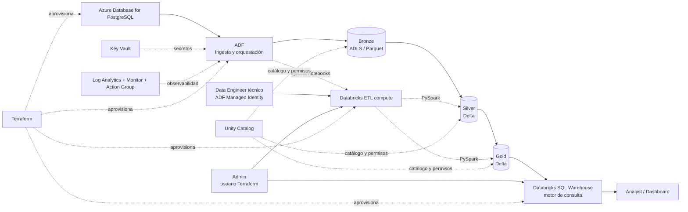
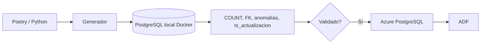
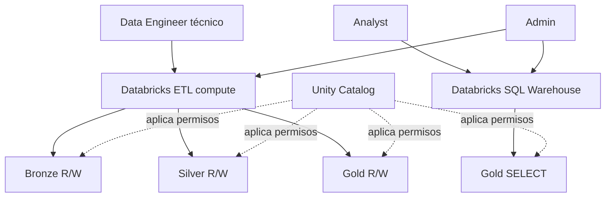

# Arquitectura

## Diagrama principal



El archivo fuente del diagrama está en `docs/arquitectura.mmd`.

## Desarrollo local: validación previa, no otra arquitectura

Antes de desplegar Azure se valida `generar_datos.py`, `00_schema.sql` y `cargar_postgresql.py` contra PostgreSQL 16 levantado con `compose.yaml`.



PostgreSQL local **no aparece en la arquitectura desplegada** y ADF no intenta conectarse a `localhost`. Su función es reducir costo y separar problemas: primero se estabiliza la fuente; después se valida el pipeline cloud.

## Responsabilidad por componente

| Componente | Responsabilidad |
|---|---|
| Azure Database for PostgreSQL Flexible Server | Fuente relacional del pipeline |
| Azure Data Factory | Ingesta incremental y orquestación |
| ADLS Gen2 Bronze | Copia fiel del origen en Parquet + auditoría |
| Azure Databricks ETL compute | Ejecuta transformaciones PySpark de Silver y Gold |
| ADLS/Delta Silver | Dato limpio, tipado, deduplicado y protegido |
| ADLS/Delta Gold | Modelo dimensional, KPIs y reglas de negocio |
| Unity Catalog | Catálogo, permisos y gobierno transversal |
| Databricks SQL Warehouse | Motor SQL para consultar Gold |
| Azure Key Vault | Secretos |
| Log Analytics / Monitor / Action Group | Logs y alertas |
| Terraform | Infraestructura reproducible y separación dev/prod |

## Flujo funcional

```text
PostgreSQL -> Ingesta (ADF) -> Bronze -> Silver -> Gold -> Consumo analítico
                                                      |
                                                      +-> SQL Warehouse
                                                      +-> Analyst / dashboard
```

Bronze, Silver y Gold son las únicas capas de datos. `Consumo analítico` es la forma de acceso a Gold. No se crea un esquema `consumo`, no se duplican tablas y no se añade otra transformación. Unity Catalog es transversal: gobierna los objetos y garantiza que Analyst vea Gold, pero no Bronze/Silver.

## Segmentación de personas y compute



No se crea un cluster por persona. El cluster ETL está destinado al procesamiento; Analyst no recibe permisos sobre él y usa únicamente SQL Warehouse para consultar Gold. Admin mantiene control total. Esta es la separación mínima que satisface el principio de mínimo privilegio sin añadir infraestructura innecesaria.

## Ambientes

`dev` y `prod` usan exactamente el mismo código. Cambian los archivos `.tfvars`, el state remoto, los nombres, los tamaños y el volumen de datos. `dev` mantiene apagados por defecto el trigger diario y el SQL Warehouse para controlar costos; `prod` los declara activos.

## Decisiones para ahorrar tiempo y costo

- ADF se define en JSON/Terraform y no depende de construir manualmente el DAG con la interfaz.
- Solo se implementan los controles y agregaciones mínimas requeridas.
- El consumo se demuestra consultando Gold mediante SQL Warehouse; Power BI es opcional.
- `dev` usa volúmenes pequeños, un worker de Databricks y auto-termination.
- El trigger diario y SQL Warehouse pueden permanecer apagados en `dev` hasta la evidencia final.
- `prod` está parametrizado pero no necesita mantenerse desplegado simultáneamente.

## Optimización de Gold

Las tablas de hechos de mayor volumen se escriben en Delta y se particionan por año/mes de la dimensión temporal principal (`fec_recepcion`, `fec_ruta`, `evento_ts` o `fecha`). Esto reduce el escaneo cuando las consultas filtran periodos. Las agregaciones diarias permanecen sin particionar por ser más pequeñas.

## Auditoría de accesos

Terraform envía las categorías de diagnóstico disponibles del workspace de Azure Databricks a Log Analytics. Esto complementa el historial de ADF y permite conservar registros de auditoría de operaciones del workspace/Unity Catalog según las categorías expuestas por la plataforma.
