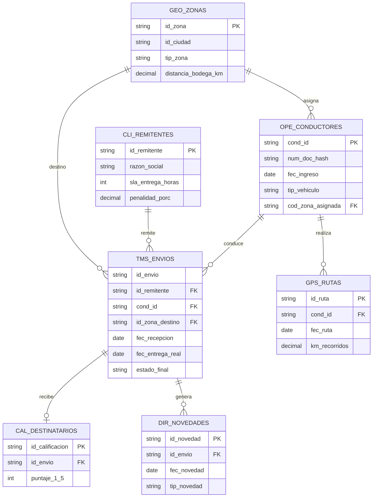

# Modelo Entidad–Relación

`TMS_ENVIOS` no impone `PRIMARY KEY` física en PostgreSQL para permitir el patrón de duplicado intencional requerido para probar la capa Silver. La clave de negocio esperada sigue siendo `id_envio`.
